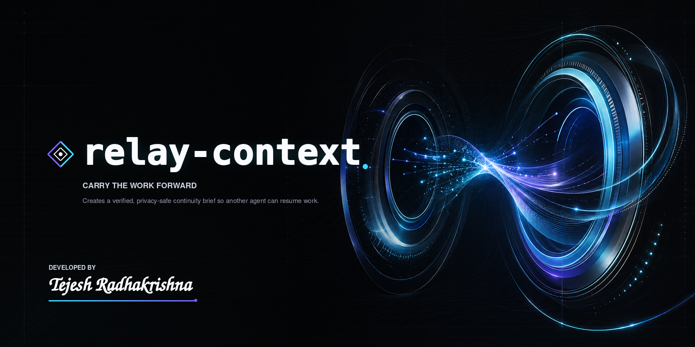

# relay-context — Relay Context

*Carry the work forward.*

## Add it

```bash
npx skills add tejeshradhakrishna/skills --skill=relay-context
```

```bash
npx skills update relay-context
```

**Upload platforms (ChatGPT Chat & Work, Claude Chat & Cowork)** — download the ready-made
[relay-context.zip](../../skills/general/relay-context.zip) and add it on the platform's custom-skill /
custom-GPT screen. No build step needed.

[Source](https://github.com/tejeshradhakrishna/skills/tree/main/skills/general/relay-context)

**Runs on** ChatGPT Chat · ChatGPT Work · Codex · Claude Chat · Claude Cowork · Claude Code. See
[COMPATIBILITY.md](../../COMPATIBILITY.md).

## The gist

I built `relay-context` for the seams in a long piece of work — the handoff, the context reset, the switch
from one tool to another — where everything you and the agent figured out tends to fall on the floor. It
turns the *verified* state of the work into a tight, vendor-neutral brief: the goal, what's genuinely done
versus what only looks done, the decisions and their reasons, the ranked next moves, the blockers, and a
continuation prompt the next agent can paste in and keep going. It's the difference between resuming and
starting over.

## Reach for it when

- You're at a boundary — passing work to another agent, another person, or your own next session.
- A context reset or the end of a long task is coming and you don't want to lose the thread.
- You're moving work across platforms and need a brief that doesn't assume any one of them.

Like `forge-decisions`, it only runs when you ask for it — a handoff, a continuation brief, a session
transfer.

## How it behaves

The brief is built from evidence: the conversation, the artifacts you can reach, the state of the workspace.
It won't call work, tests, decisions, or approvals done unless the evidence backs that up, and it keeps
assumptions, inferences, and unknowns visibly separate from verified fact. Exact paths, URLs, commands,
identifiers, dates, and owners are carried over as-is; secrets, tokens, and sensitive data are stripped and
replaced with plain markers — never partially preserved.

Steer it with **focus** (what the next session tackles) and **delivery** (`inline`, `file`, or `both`).
There's no depth dial to set: it sizes the brief to the work on its own, keeping only the state that affects
safe continuation and leaving the rest out — so the handoff stays lean without you tuning it. Hand it an
earlier brief and it updates that in place — re-checking the facts, keeping what still holds, and swapping
out what's gone stale instead of piling on a second summary.

## Signs it worked

- The next agent can act straight from the brief, without rereading the original conversation.
- Nothing is presented as finished unless it truly was.
- No secret leaks into the output, and every reference — path, URL, ticket — is exact.

## Pairs with

Use it at the end of a working session or right before a boundary. It follows naturally from
[forge-decisions](./forge-decisions.md): settle the plan's decisions first, then relay the verified state so
the next agent starts from solid ground rather than guesswork.
