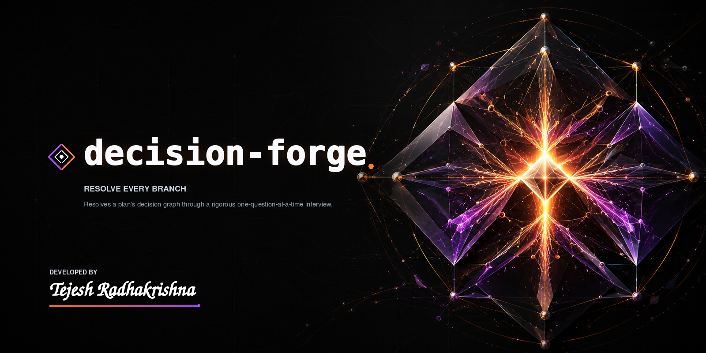

# general

General-purpose skills — the ones that aren't tied to a specific domain. Both ship to users, so each is
listed in the [top-level README](../../README.md), carried in
[`.claude-plugin/plugin.json`](../../.claude-plugin/plugin.json), and documented under
[`docs/general/`](../../docs/general). Both run on every supported platform — see
[COMPATIBILITY.md](../../COMPATIBILITY.md). Both are explicit-only: you invoke them by name.

## decision-forge

**[forge-decisions](./forge-decisions/SKILL.md)** — *Resolve every branch.* A disciplined,
one-question-at-a-time interview that settles a plan's open decisions and writes them down as a decision
brief, a `CONTEXT.md`, and ADRs. Pick **Quick**, **Standard**, or **Comprehensive** to match the depth — and
the token spend — to the stakes. Use it to make a shaky plan buildable before anything gets built.

## relay-context

**[relay-context](./relay-context/SKILL.md)** — *Carry the work forward.* A verified, privacy-safe
continuity brief so the next session, agent, or platform can resume without rereading everything: real state,
decisions, ranked next steps, blockers, and a continuation prompt.
